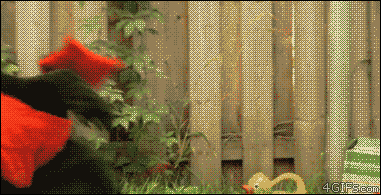

# My first RPG game 🧙
My first RPG Game in Python! 🕹️ Using Object Oriented Programming.  

## Concepts applied:
The 4 pilars of Object Oriented Programming 
- Abstraction
- Encapsulation
- Inheritance
- Polymorphism

## Sneakpeek of the game:

